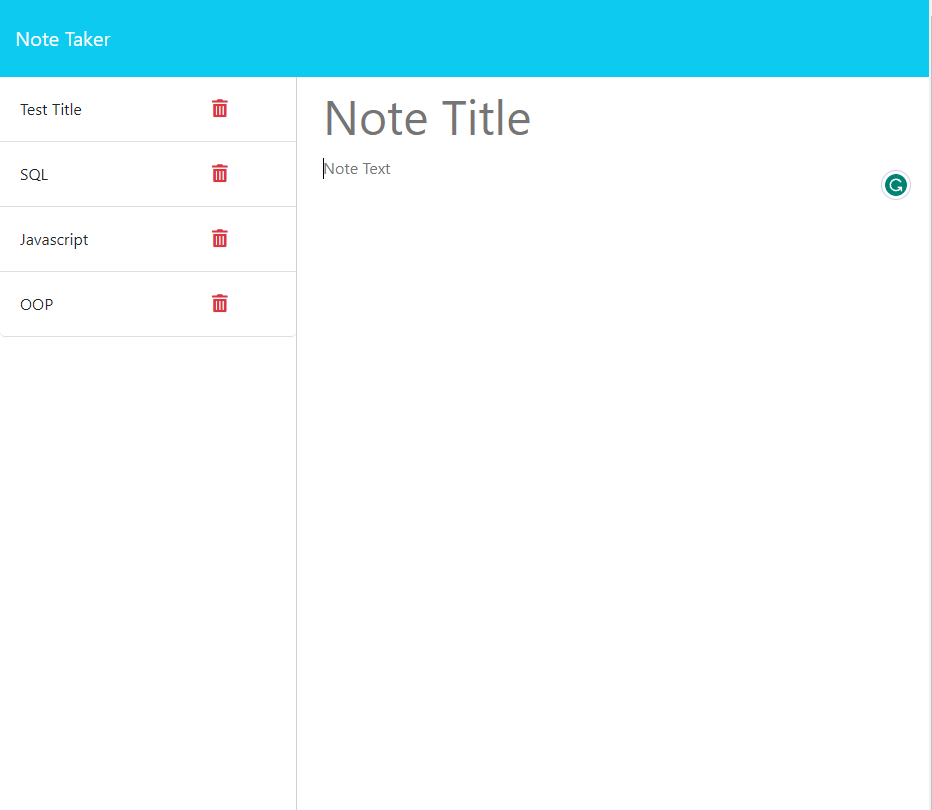

# About
This is Module 11 Challenge by the Ohio State University bootcamp. This project is about sending and retrieving all the user data through accessing the server's backend. 

## Description
When the user enters the website, they will be presented with a 'Get Started' button. Upon clicking on it, they will be brought to a note page that allows them to freely write, save and delete notes. The notes will be saved to the db/db.json file and will show up everytime they enter the website.

## Image of the 'logo.svg' file

## Link to the deployed application
Heroku Deployed URL: https://note-taker-by-villy-69d0423be6ee.herokuapp.com/notes